# Diagrama de classes crypto-bot-delivery. 

Arquitetura do robô autônomo descentralizado de entrega.

## Diagrama de Classes - Crypto Bot Delivery

```mermaid
classDiagram
    %% Sistema de Cotação e Pagamento
    class DeliveryAPI {
        -encryption_key: Fernet
        -cipher_suite: Fernet
        -gmaps: googlemaps.Client
        +create_quote(request: DeliveryRequest): QuoteResponse
        +confirm_payment(payment: PaymentData): PaymentResponse
        +encrypt_delivery_data(data: dict): str
        +decrypt_delivery_data(encrypted_data: str): dict
    }

    class DeliveryRequest {
        +origin: str
        +destination: str
        +package_weight: float
        +package_size: str
    }

    class PaymentData {
        +delivery_id: str
        +amount: float
        +crypto_address: str
    }

    class QuoteResponse {
        +delivery_id: str
        +price: float
        +distance_km: float
        +estimated_duration_min: int
        +encrypted_data: str
        +payment_address: str
    }

    %% Sistema de Navegação Autônoma
    class DeliveryNavigationController {
        -nav_client: ActionClient
        -cmd_vel_pub: Publisher
        -laser_sub: Subscription
        -current_delivery: dict
        -robot_state: str
        -obstacle_detected: bool
        +start_delivery(delivery_data: dict): bool
        +navigate_to_pickup(): void
        +navigate_to_destination(): void
        +laser_callback(msg: LaserScan): void
        +check_obstacles(): bool
        +emergency_stop(): void
        +update_delivery_status(status: str): void
    }

    class NavigationGoal {
        +pose: PoseStamped
        +delivery_id: str
        +goal_type: str
        +timestamp: datetime
    }

    %% Sistema de Criptografia e Blockchain
    class CryptoManager {
        -web3_client: Web3
        -private_key: str
        -contract_address: str
        +verify_payment(tx_hash: str): bool
        +create_escrow(delivery_id: str, amount: float): str
        +release_payment(delivery_id: str): bool
        +generate_wallet(): dict
        +sign_transaction(tx_data: dict): str
    }

    class SmartContract {
        +contract_address: str
        +abi: list
        +create_delivery_order(params: dict): str
        +confirm_pickup(delivery_id: str): bool
        +confirm_delivery(delivery_id: str): bool
        +release_escrow(delivery_id: str): bool
    }

    %% Sistema de QR Code
    class QRCodeManager {
        -camera_sub: Subscription
        -qr_pub: Publisher
        +generate_pickup_qr(delivery_id: str): str
        +generate_delivery_qr(delivery_id: str): str
        +scan_qr_code(): dict
        +validate_qr_data(qr_data: dict): bool
        +camera_callback(msg: Image): void
        +process_qr_detection(image: np.array): dict
    }

    class QRCodeData {
        +delivery_id: str
        +action: str
        +timestamp: datetime
        +robot_id: str
        +signature: str
    }

    %% Entidades de Domínio
    class Delivery {
        +delivery_id: str
        +origin: str
        +destination: str
        +package_info: PackageInfo
        +status: DeliveryStatus
        +price: float
        +payment_status: PaymentStatus
        +robot_id: str
        +created_at: datetime
        +pickup_time: datetime
        +delivery_time: datetime
        +route_data: dict
    }

    class PackageInfo {
        +weight: float
        +size: str
        +dimensions: dict
        +special_instructions: str
        +fragile: bool
    }

    class Robot {
        +robot_id: str
        +status: RobotStatus
        +current_location: Location
        +battery_level: float
        +cargo_capacity: float
        +current_delivery: str
        +last_maintenance: datetime
        +update_location(location: Location): void
        +update_battery(level: float): void
        +set_status(status: RobotStatus): void
    }

    class Location {
        +latitude: float
        +longitude: float
        +altitude: float
        +timestamp: datetime
    }

    %% Enums
    class DeliveryStatus {
        >
        PENDING
        PAYMENT_CONFIRMED
        PICKUP_ASSIGNED
        IN_TRANSIT_TO_PICKUP
        PICKUP_COMPLETED
        IN_TRANSIT_TO_DESTINATION
        DELIVERED
        CANCELLED
        FAILED
    }

    class PaymentStatus {
        >
        PENDING
        CONFIRMED
        ESCROW_CREATED
        RELEASED
        REFUNDED
    }

    class RobotStatus {
        >
        IDLE
        ASSIGNED
        NAVIGATING
        PICKING_UP
        DELIVERING
        MAINTENANCE
        OFFLINE
    }

    %% Sistema de Simulação
    class SimulationManager {
        +world_file: str
        +robot_models: list
        +spawn_robot(robot_id: str): bool
        +create_environment(): void
        +run_simulation(): void
        +stop_simulation(): void
    }

    class GazeboWorld {
        +world_name: str
        +obstacles: list
        +pickup_points: list
        +delivery_points: list
        +load_world(): void
        +add_obstacle(obstacle: dict): void
    }

    %% Relacionamentos
    DeliveryAPI --> DeliveryRequest
    DeliveryAPI --> PaymentData
    DeliveryAPI --> QuoteResponse
    DeliveryAPI --> CryptoManager
    
    DeliveryNavigationController --> NavigationGoal
    DeliveryNavigationController --> Robot
    DeliveryNavigationController --> QRCodeManager
    
    CryptoManager --> SmartContract
    
    QRCodeManager --> QRCodeData
    
    Delivery --> PackageInfo
    Delivery --> DeliveryStatus
    Delivery --> PaymentStatus
    Delivery --> Location
    
    Robot --> RobotStatus
    Robot --> Location
    
    SimulationManager --> GazeboWorld
    SimulationManager --> Robot
    
    %% Agregações
    DeliveryAPI ..> Delivery : creates
    DeliveryNavigationController ..> Delivery : processes
    QRCodeManager ..> Delivery : validates
    CryptoManager ..> Delivery : secures
```

## **Descrição das Classes Principais**

### **Sistema de Cotação e Pagamento**
- **DeliveryAPI**: Gerencia cotações, pagamentos e criptografia de dados sensíveis[2]
- **DeliveryRequest/PaymentData**: DTOs para requisições de entrega e pagamento
- **QuoteResponse**: Resposta com preço, distância e dados criptografados

### **Sistema de Navegação Autônoma**
- **DeliveryNavigationController**: Controlador principal para navegação ROS2[2]
- **NavigationGoal**: Representa objetivos de navegação com metadados de entrega
- **Robot**: Entidade que representa o estado físico do robô

### **Sistema de Criptografia e Blockchain**
- **CryptoManager**: Gerencia carteiras, transações e verificações de pagamento[2]
- **SmartContract**: Interface para contratos inteligentes de escrow

### **Sistema de QR Code**
- **QRCodeManager**: Gera e valida QR codes para confirmação de pickup/entrega[2]
- **QRCodeData**: Estrutura de dados do QR code com assinatura digital

### **Entidades de Domínio**
- **Delivery**: Entidade central que representa uma entrega completa
- **PackageInfo**: Informações detalhadas do pacote
- **Location**: Coordenadas geográficas com timestamp

### **Sistema de Simulação**
- **SimulationManager**: Gerencia ambiente Gazebo para testes[2]
- **GazeboWorld**: Configuração do mundo virtual com obstáculos

## **Padrões Arquiteturais Implementados**

**Arquitetura Hexagonal**: Separação clara entre domínio (Delivery, Robot) e infraestrutura (APIs, ROS2, Blockchain)

**Event-Driven**: Comunicação assíncrona via WebSockets e tópicos ROS2

**Microserviços**: Cada sistema (navegação, pagamento, QR) opera independentemente

**Blockchain Integration**: Smart contracts para escrow descentralizado e pagamentos seguros

Esta arquitetura garante que o robô autônomo seja verdadeiramente descentralizado, seguro e eficiente, seguindo as especificações do projeto crypto-bot-delivery[2].

Citations:
[1] https://github.com/govinda777/crypto-bot-delivery/blob/main/CLASS_DIAGRAM.md
[2] https://github.com/govinda777/crypto-bot-delivery
[3] https://www.youtube.com/watch?v=GdlFhF6gjKo
[4] https://github.com/chaoui940/Ai-Crypto-Trading-Bot-Automated-Bitcoin-Cryptocurrency
[5] https://www.youtube.com/watch?v=cYqNBY7i0hI
[6] https://nkmakes.github.io/2020/10/18/crypto-trading-bot-open-source-comparison/
[7] https://github.com/sandraambvk/crptdwkecc
[8] https://github.com/gazbert/bxbot
[9] https://github.com/Drakkar-Software/OctoBot
[10] https://github.com/osprey17alfaboy/Ai-Crypto-Trading-Bot-Automated-Bitcoin-Cryptocurrency
[11] https://github.com/Desert9Dune/crypto-trading-bot

---
Answer from Perplexity: pplx.ai/share
