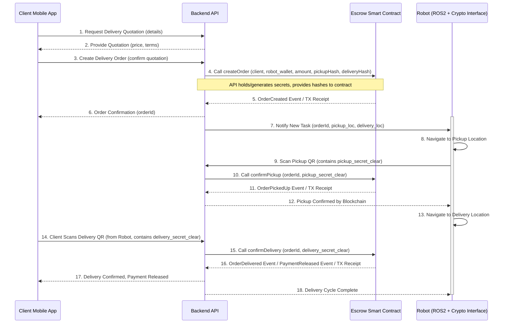

# POC 1: Blockchain Integration

## Overview

This Proof of Concept (POC) demonstrates the integration of a blockchain-based escrow system for managing payments in the Crypto Bot Delivery system. It showcases:
- An Ethereum smart contract (`Escrow.sol`) to hold funds in escrow.
- A Python script (`blockchain_interface.py`) that interacts with the smart contract using the Web3.py library to simulate a delivery workflow.

The key components involved are:
- **`Escrow.sol`**: The Solidity smart contract defining the escrow logic. Located in `crypto-bot-delivery/smart_contracts/`.
- **`Escrow.json`**: The ABI (Application Binary Interface) of the `Escrow.sol` contract, necessary for interacting with it. Located in `crypto-bot-delivery/smart_contracts/`.
- **`blockchain_interface.py`**: The Python script that simulates client and robot interactions with the smart contract. Located in `crypto-bot-delivery/src/delivery_crypto/`.

## Delivery Transaction Flow (Sequence Diagram)

The following diagram illustrates the sequence of interactions for a typical delivery order:


*(Note: The QR code scanning part implies an interaction where the robot might display a QR code, or the client/robot scans a code associated with the location/package. The secrets are simplified here as being scanned directly for clarity in the diagram).*

## Prerequisites

Before running this POC, ensure you have the following installed:

*   **Python 3.10+**
*   **Node.js and npm:** Required if you need to recompile the smart contract (using `npx solc`) or for running local development tools like Ganache.
*   **Ganache:** A local Ethereum testnet. Download from [Truffle Suite](https://trufflesuite.com/ganache/). Ensure it's installed and running.
    *   When setting up Ganache, note the RPC Server URL (e.g., `http://127.0.0.1:7545`).
    *   Take note of at least two account private keys from Ganache to use for the Client and Robot.
*   **`web3.py` Python library:** Install using pip:
    ```bash
    pip install web3
    ```

## Setup Instructions

### 1. Smart Contract (`Escrow.sol`)

*   **Location:** The smart contract source code `Escrow.sol` is located in the `crypto-bot-delivery/smart_contracts/` directory.
*   **ABI:** The compiled ABI, `Escrow.json`, is also provided in `crypto-bot-delivery/smart_contracts/`. It was generated from `Escrow.sol`. If you modify `Escrow.sol`, you will need to recompile it (see project's main README for compilation instructions).

*   **Deployment to Ganache:**
    The `blockchain_interface.py` script assumes the `Escrow.sol` contract is already deployed on your running Ganache instance. You can deploy it using tools like Remix IDE:
    1.  Open [Remix IDE](https://remix.ethereum.org/) in your browser.
    2.  Load `Escrow.sol` into Remix.
    3.  In the "Solidity Compiler" tab, select a compatible compiler version (e.g., `0.8.0` or higher as per `pragma solidity ^0.8.0;`) and compile `Escrow.sol`.
    4.  In the "Deploy & Run Transactions" tab:
        *   Set the "Environment" to "Injected Provider - Web3" (if using MetaMask connected to Ganache) or "Ganache Provider" (if Remix offers a direct connection, newer versions might call this "Dev - Ganache Provider" or similar, ensure it points to your local Ganache instance e.g. http://127.0.0.1:7545). If using "Injected Provider", ensure MetaMask is connected to your local Ganache network.
        *   The `Escrow` contract should be selected in the "Contract" dropdown.
        *   Click "Deploy".
    5.  Once deployed, copy the "Deployed Contracts" address. This is your `ESCROW_CONTRACT_ADDRESS`.

### 2. Python Script (`blockchain_interface.py`)

1.  **Navigate to the script directory:**
    ```bash
    cd crypto-bot-delivery/src/delivery_crypto/
    ```

2.  **Set Environment Variables:**
    The `blockchain_interface.py` script requires the following environment variables to be set. You can set them in your terminal session or use a `.env` file with a library like `python-dotenv` (not included by default).

    *   `ETH_NODE_URL`: The RPC URL of your Ganache instance.
        ```bash
        export ETH_NODE_URL="http://127.0.0.1:7545" 
        ```
        (Replace with your Ganache RPC server URL if different).

    *   `ESCROW_CONTRACT_ADDRESS`: The address of the `Escrow` contract you deployed on Ganache.
        ```bash
        export ESCROW_CONTRACT_ADDRESS="YOUR_DEPLOYED_CONTRACT_ADDRESS_HERE"
        ```

    *   `CLIENT_PRIVATE_KEY`: The private key of an account from Ganache to act as the client.
        **WARNING: These are for local testing with Ganache only. Never expose real private keys.**
        ```bash
        export CLIENT_PRIVATE_KEY="0xYOUR_GANACHE_CLIENT_ACCOUNT_PRIVATE_KEY"
        ```

    *   `ROBOT_PRIVATE_KEY`: The private key of another account from Ganache to act as the robot/delivery provider.
        ```bash
        export ROBOT_PRIVATE_KEY="0xYOUR_GANACHE_ROBOT_ACCOUNT_PRIVATE_KEY"
        ```
    *   `CONTRACT_ABI_PATH` (Optional): This variable specifies the path to the `Escrow.json` ABI file *relative to the `blockchain_interface.py` script's location*. The script defaults to `../../smart_contracts/Escrow.json` (i.e., `crypto-bot-delivery/smart_contracts/Escrow.json` from the project root). You only need to set this if you move the ABI file.
        Example if you had it in the same directory as the script:
        ```bash
        # export CONTRACT_ABI_PATH="Escrow.json" 
        ```

## Running the POC

1.  Ensure your Ganache instance is running and the `Escrow.sol` contract is deployed.
2.  Ensure all required environment variables (`ETH_NODE_URL`, `ESCROW_CONTRACT_ADDRESS`, `CLIENT_PRIVATE_KEY`, `ROBOT_PRIVATE_KEY`) are set in your terminal session.
3.  Navigate to the script's directory (if not already there):
    ```bash
    cd crypto-bot-delivery/src/delivery_crypto/
    ```
4.  Run the Python script:
    ```bash
    python blockchain_interface.py
    ```

**Expected Output:**

The script will print console logs detailing its actions:
*   Connection to the Ethereum node (Ganache).
*   Loading of client and robot accounts, showing their addresses and initial balances.
*   Loading of the Escrow contract.
*   **Order Creation:** Logs showing the client creating a new delivery order, the transaction details, and the updated order status from the smart contract.
*   **Pickup Confirmation:** Logs showing the robot confirming the pickup, transaction details, and the updated order status.
*   **Delivery Confirmation & Payment Release:** Logs showing the client confirming delivery, transaction details, the updated order status, and the payment being released to the robot.
*   Final balances for the client and robot accounts, illustrating the transfer of funds (minus gas costs).
*   Details of the order fetched from the smart contract at each step.

## Running Blockchain Integration Tests (BDD)

This project includes Behavior-Driven Development (BDD) tests for the `Escrow.sol` smart contract lifecycle using `pytest` and `pytest-bdd`. These tests interact with a live blockchain environment (typically a local testnet like Ganache).

**1. Prerequisites for Testing:**

*   **Python Environment:** Ensure you have Python 3.10+ and `pip` installed.
*   **Install Test Dependencies:** Navigate to the root of the `crypto-bot-delivery` project directory. It's recommended to use a virtual environment.
    ```bash
    python -m venv venv
    source venv/bin/activate  # On Windows: venv\Scripts\activate
    pip install pytest pytest-mock pytest-bdd web3 python-dotenv eth-tester # Add other deps if used by tests
    pip install -e . # Install crypto-bot-delivery in editable mode
    ```
    *(Note: A `requirements-dev.txt` or `pyproject.toml` [testing extra] would typically manage these.)*
*   **Ganache:** Ensure Ganache (or your configured Ethereum testnet) is running. The tests default to `http://127.0.0.1:7545`.
    *   Make sure Ganache has several funded accounts available. The tests use the first few accounts for deploying the contract, and as "Alice" (client) and "RoboDeliverer" (robot).
*   **Smart Contract Artifacts:** The tests require the compiled smart contract ABI (`Escrow.json`) and bytecode (`Escrow.bin`). These should be present in `crypto-bot-delivery/smart_contracts/`. If not, recompile the contract (e.g., using `npx solc ...` as described in main project setup or the `smart_contract_guide.md`).

**2. Running the Tests:**

*   **Navigate to Project Root:** Open your terminal and go to the root directory of the `crypto-bot-delivery` project.
    ```bash
    cd /path/to/crypto-bot-delivery
    ```
*   **Activate Virtual Environment (if used):**
    ```bash
    source venv/bin/activate
    ```
*   **Run `pytest`:**
    Execute `pytest`. It will automatically discover and run tests in the `src/delivery_crypto/tests/` directory, including both unit tests (`test_*.py`) and BDD tests (`test_*_steps.py` with `.feature` files).
    ```bash
    pytest -v src/delivery_crypto/tests/
    ```
    *   The `-v` flag provides verbose output.
    *   You can also run specific test files or use markers if configured.

**3. Interpreting Test Output:**

*   `pytest` will show the status of each test (passed, failed, skipped).
*   For BDD tests, `pytest-bdd` provides output that maps to the Gherkin scenarios and steps.
*   If tests fail, the output will include details about the failure, such as assertion errors or exceptions. This can help diagnose issues with the smart contract logic or the test implementation.

**4. Test Coverage (Optional):**
*   To measure test coverage for your Python code (like `blockchain_interface.py`), you can use `pytest-cov`:
    ```bash
    pip install pytest-cov
    pytest --cov=src/delivery_crypto src/delivery_crypto/tests/
    ```

## Demonstration Points

This POC aims to demonstrate:

*   **Smart contract for escrow of payments:** The `Escrow.sol` contract handles holding and releasing funds based on delivery confirmations.
*   **Creation of crypto wallet for the robot:** While the script doesn't create a new wallet on the fly, it loads a pre-existing robot account from Ganache using its private key, simulating the robot's wallet.
*   **Verification of transactions and automatic liberation of funds:** The script's output will show transaction hashes and receipts. The final step of `confirm_delivery_and_release` triggers the smart contract to automatically transfer the escrowed amount to the robot's account. Balance changes will reflect this.
